## UI/UX

- Use dark mode theme like [bangalore_companies.jsx](ref/bangalore_companies.jsx) app

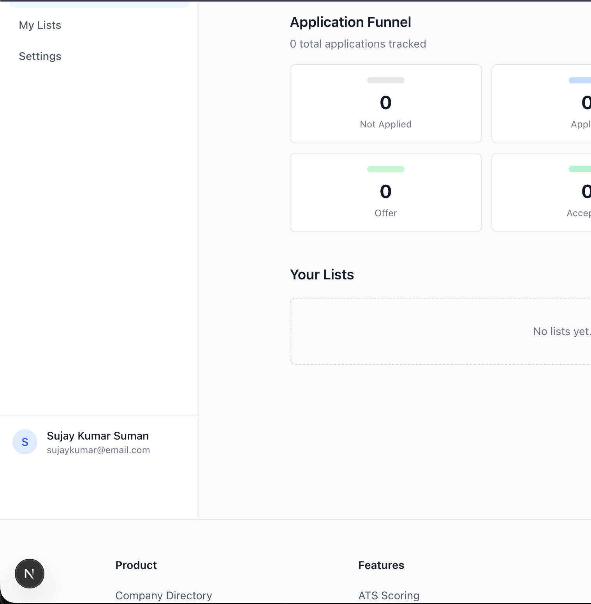
- In the left navigation panel, the name section is not fixed and scrolls along with page, I think it should stick to bottoms (don't you agree?)

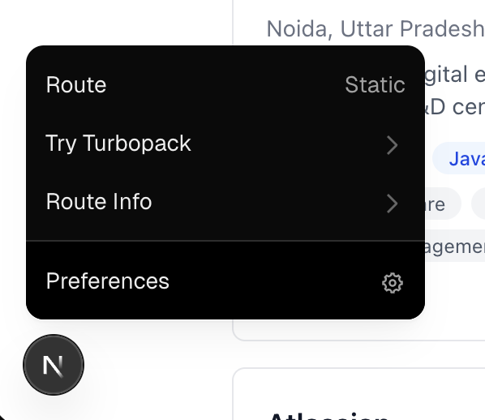
- I don't know what this floating black "N" button is. What are these options it opens when clicked? Can you elaborate if it was intentional? If yes, what is it used for and how it can be useful? If no and it is part of some theme or thridparty, can it be removed? If I decide to keep it, will this be visible to every user or just admins and moderators?

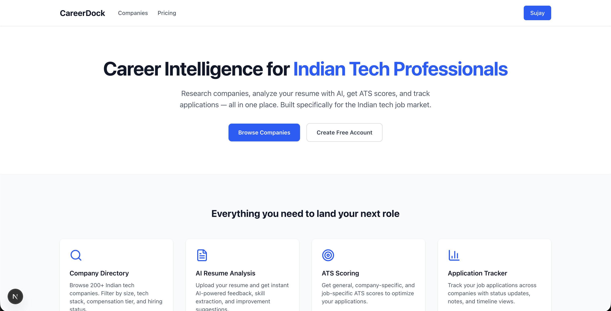

- While logged in, clicking on main logo, brings it to this page. I think this needs to be redesigned and should be different when logged in as a user and different when logged out. This even has the "Create Free Account" button even though the user is already logged in. Maybe, when logged in, it should be dashboard by default.

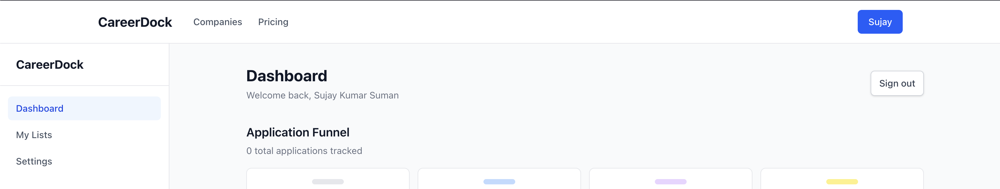

- Right now, to open dashboard, I have to click on my name - this is a bit ambiguous as one would not know about existence of dashboard until clicked on it. Since we have the name of signed in user at the bottom of the navigation pane, it can be used for something else, like instead of having sign out button only on dashboard, replace the blue name button with a sign out one.

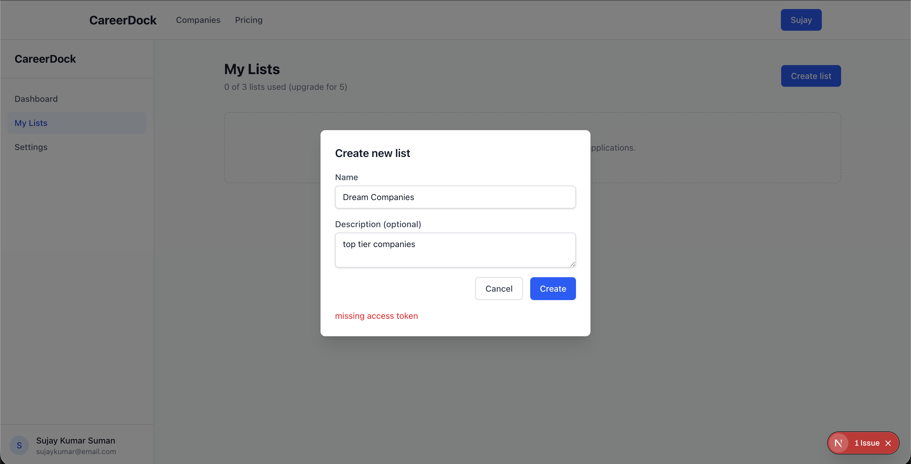
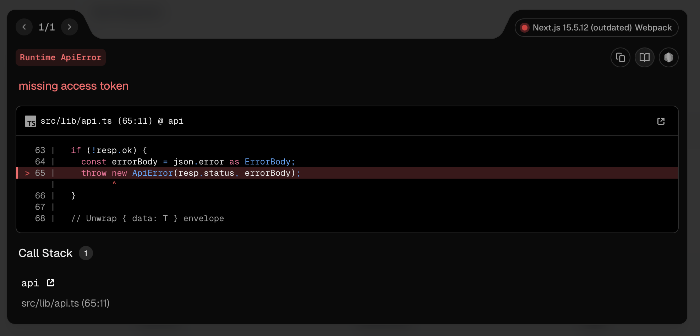
- Unable to create lists due to some missing token apparently.

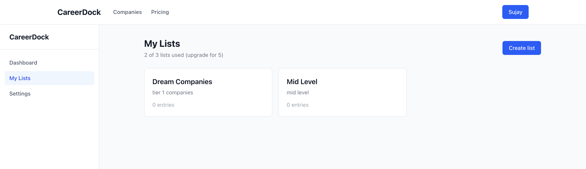

- Was able to create after re-logging.

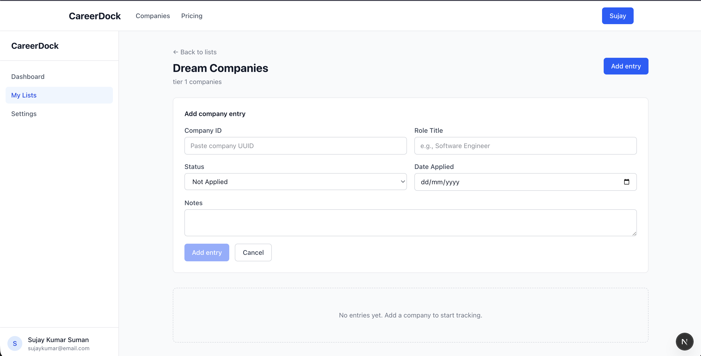
- This way of adding companies seems way to hectic. No one remembers or knows company ID. Adding companies should be an easy task. From the list we should see dropdown of the companies to add to the list. We should be able to add companies in shortlisting companies phase too, not only with an application. We should also be able to add companies to the lists from the "all companies" (default) list with a single button (like adding an item to wishlist).

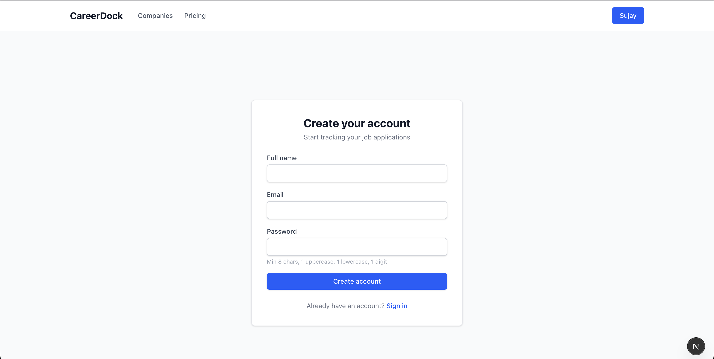

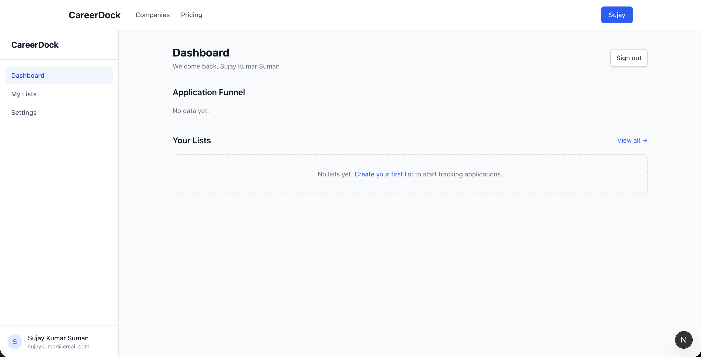
- I think there must be some issue with how sessions are timed out or something as I can still see Blue "Sujay" button in top nav bar and it still asks me to login when I click "Get Starter Pack" from Pricing page after leaving page unattended for a while (around 5-10 mins). Though at this state, I don't see any of the created lists unless I sign in again - but still if I'm logged out internally, UI should not show personal info of logged out users. Also, should the session be so short lived?

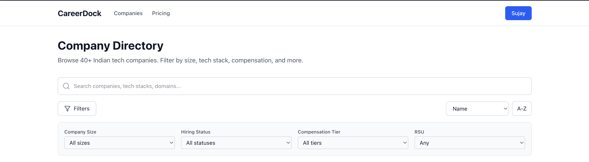
- The filter mechanism seems out dated, use bangalore_companies.jsx like filter. Same filters should be available in user specific lists. Their should be more filters like office modes (remote, hybrid, full-time) locations(multiple if the company has offices in multiple locations) etc.

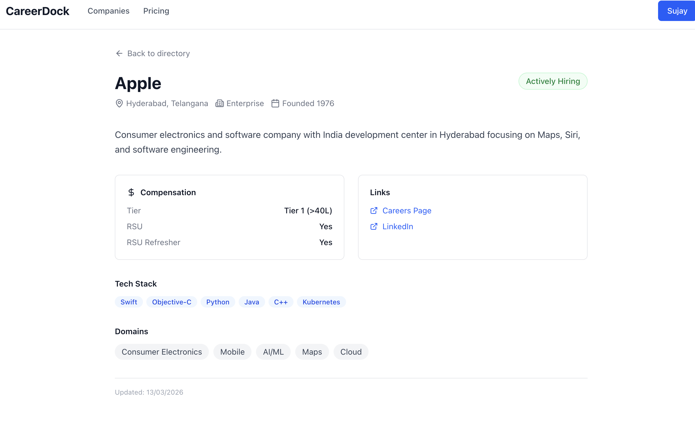
- If I open certain company page, it should also show applied jobs for that company with easy button to update state of the application

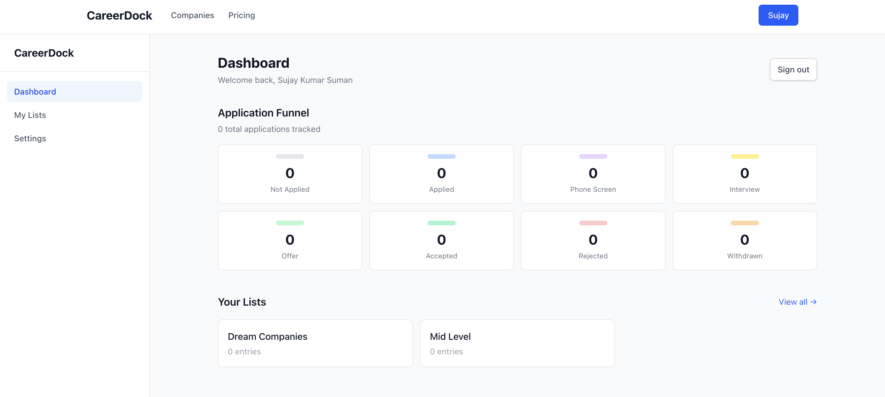
- There should be an applications page as well if there isn't yet which can show all applications and can be filtered by state similar to companies filtering by stats/tags. Clicking on any of application funnel can open that page with the selected filter applied.

## Payments

- Before moving to payments, I want it all to be feature flagged.
- So at the time of testing, and until production deployment, actual payments can be bypassed.

## Admin Panel

- Admins should be able to make control premium access to users via admin panel and control the action quantities for every users as well (this is to allow certain users premium access via admin approval and not via payment routes). For eg, I should be able to make users permanent premium and they don't have to buy anything ever courtesy of admin.
- The admin panel should be able to manage pricing for every pack and by users (enabling special offers for certain category of users or sale period and stuff)
