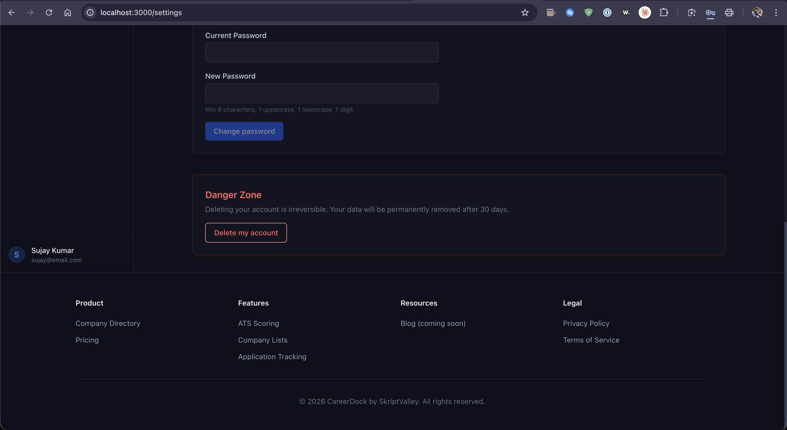
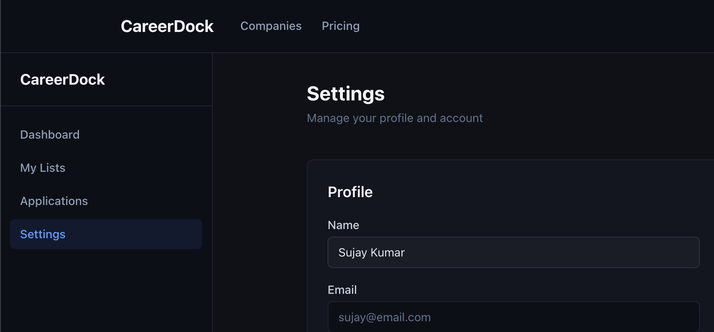
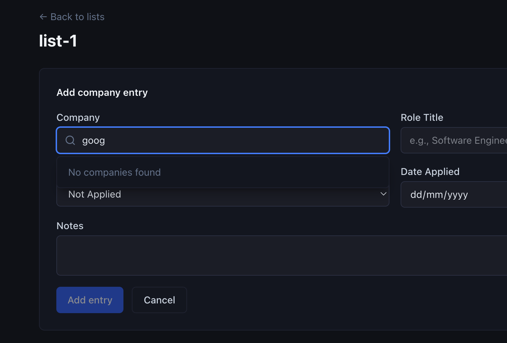
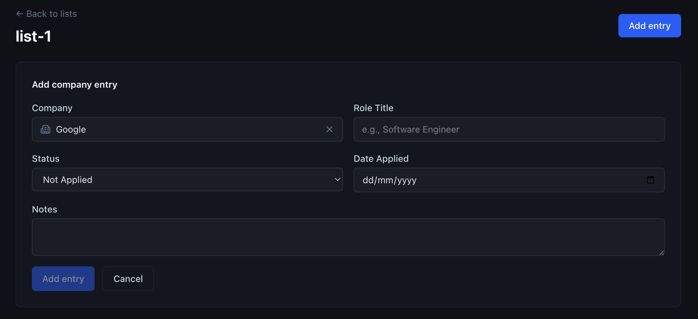
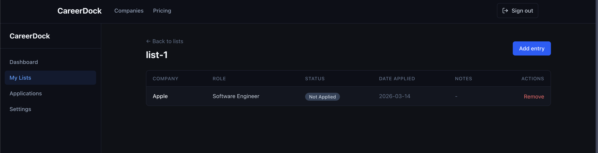
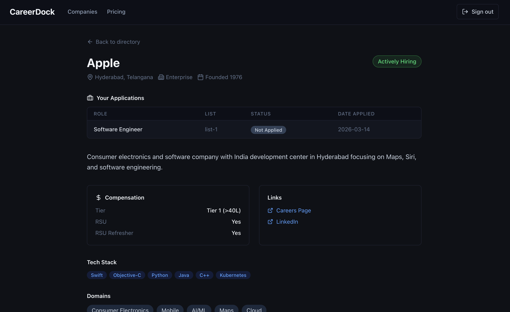
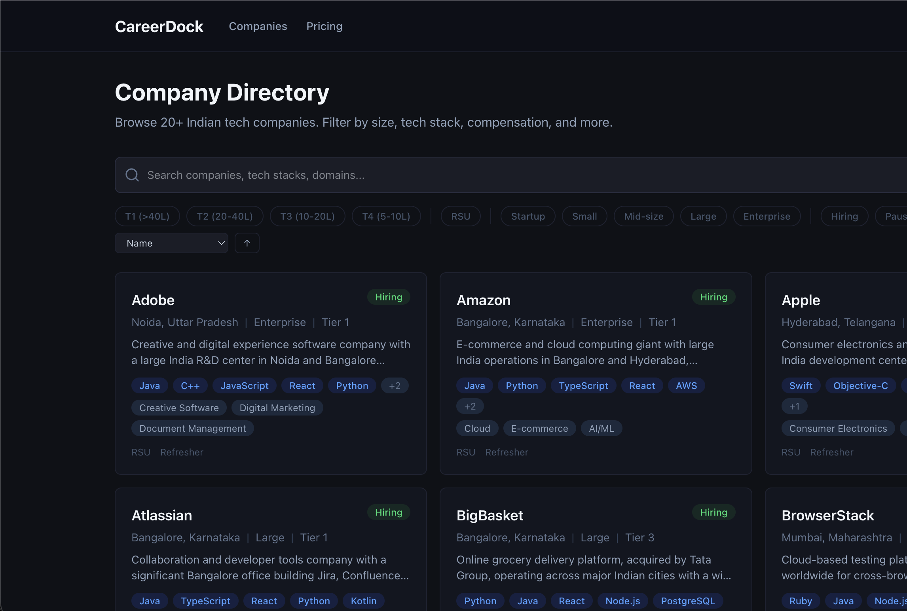

## UI/UX

- Though the name pane is now sticky to bottom but now I have to scroll to the bottom to reach it. Can you not make left navigation pane fixed?

- There are 2 logos now, don't need both. Header one is enough.

- Search is not working properly. The company does not list unless complete string matches the name. Search should match patterns.

- still to add entry I need to fill in lot of unecessary details. The companies should be able to added to the list as it is. I suggest instead of this form, lets list all the companies with similar filters and search in dashboard while creating a list or editing a list where the can select multiple companies (like checkboxes but checked items should be highlighted without the need of an actual checkbox) and save the changes to the list.
- The details currently asked here are supposed to be asked only while adding a job application to track of a company.

- the lists are for companies, not application. The company lists are supposed to show company status, they are different than application status. company status is like - marked, applied, shortlisted, interviewing, offered, accepted/rejected, etc. Though applications are similar but companies should have their own status to track overall status of progress with that company.
- clicking on company name on lists should open company profile with list of application.

- I think keeping the list of application after company metadata would be better.
- Apart from each individual status of application, the company metadata can also showcase overall status of the company progress.
- If the company is part of multiple lists - show all of them. A label chip similar to status would look good. Clicking the list label can then open that list.

- I want navigation pane to be available on other pages to.
- Make it colapsible and when expanded, the main page content can readjust as per available space.

---

- UI is better than previous but would love a more tech, electro, neon theme accross.

## Payments

- I'm thinking of making credits a common currency to do something accross the platform. So we can still offer credits but map it each action like currency
