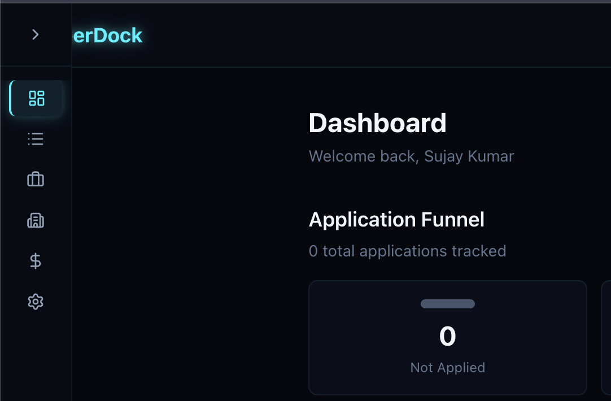
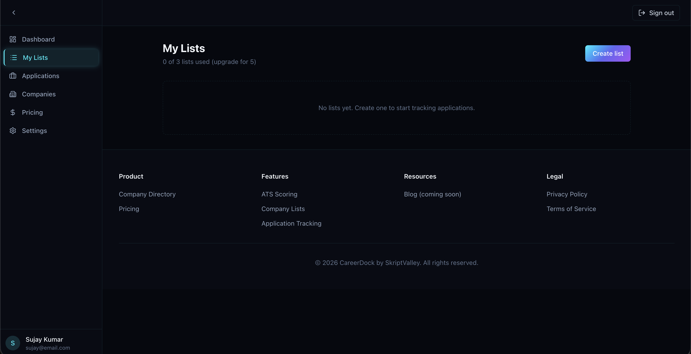
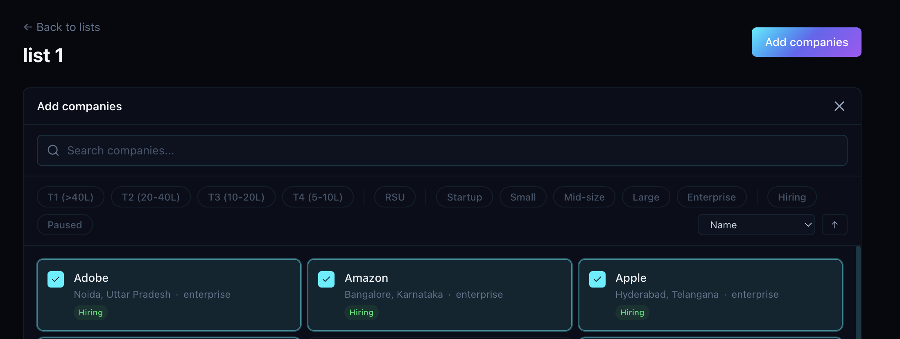
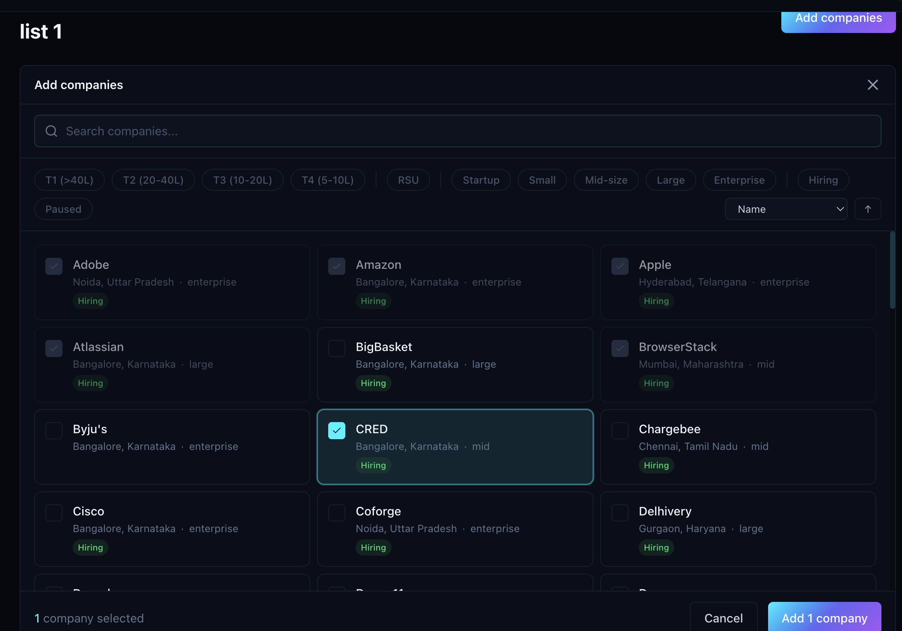
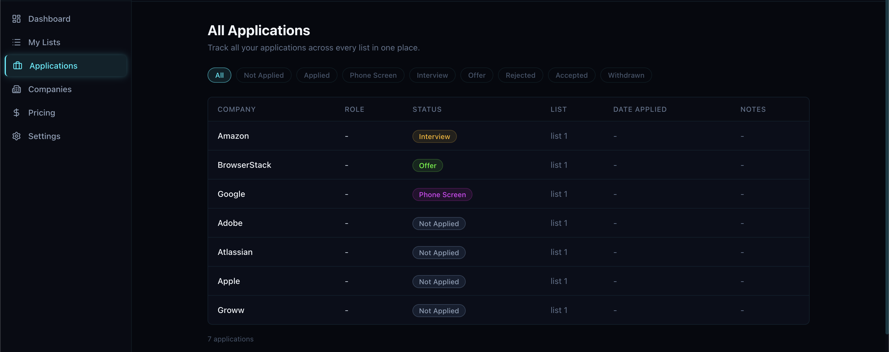
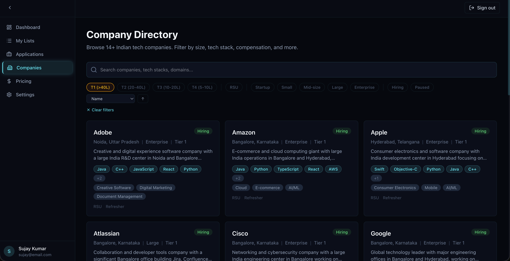

## Session 03 Feedback

Use this as an implementation-oriented feedback prompt for the next UI pass. Keep the neon / tech visual direction, but make the interaction model more consistent across companies, applications, and lists.

## Core Model

These entities should stay clearly separated in both UI and behavior:

- Companies are the parent entity. A company has its own metadata, appears in cards and company detail pages, and can have multiple applications.
- Applications always belong to a company. They should be tracked either from the company page or from a dedicated applications page that aggregates all applications.
- Lists are company wishlists or tracking buckets. They are not application containers. A list should show company-specific data, not application-specific structure.

Suggested list columns:
- Company name
- Overall company status
- Applications count
- `+ Add Application`

The applications count should be clickable and open the applications page with the selected company filter applied.
The `+ Add Application` column should open a quick modal form that lets the user create and track a new application for the selected company without leaving the list view.

## UI / UX Feedback

### 1. Navigation pane hides the logo

Issue:
- The navigation pane overlaps or hides the logo.

Expected result:
- The navigation layout should preserve logo visibility at all times.
- Sidebar open, collapsed, and responsive states should not cover branding.

### 2. Footer floats in the middle on short pages

Issue:
- On pages with limited content, the footer appears in the middle of the screen instead of staying at the bottom.

Expected result:
- The footer should remain pinned to the bottom of the viewport on short pages.
- On long pages, it should appear after the content normally.

### 3. List editing flow is broken and confusing

Issues:
- The `Add Companies` button does not work while creating or editing a list.
- The CTA label does not match the actual action once the list enters selection mode.
- Editing a list should support both adding new companies and removing existing ones.

Expected result:
- Replace the broken `Add Companies` action with a working edit flow.
- Once selection mode is active, the CTA should switch to something like `Save Changes`.
- The same flow should support both add and remove operations before saving.

### 4. Remove action is placed in the wrong area

Issues:
- Removing a company should not happen from the current row-level action in this view.
- This area would be more useful for company or application management actions.

Expected result:
- Company removal should happen inside the list update flow.
- Unselecting a company during list editing should count as removal.
- Replace the current action with something more aligned to the page, such as `Manage Applications` where relevant.

### 5. Save action should represent full list updates

Issues:
- `Add 1 Company` is too narrow and does not reflect removal or general editing.
- The top `Add Companies` state is also misleading and currently non-functional.

Expected result:
- Use a broader action label such as `Save Changes`.
- Make the save action clearly cover both additions and removals.
- If removed companies are previewed before save, highlighting them in red is acceptable and fits the visual direction.

### 6. Applications page should only show actual applications

Issues:
- Companies with no applications should not appear on the applications page.
- The current UI blurs the distinction between company tracking and application tracking.

Expected result:
- The applications page should show only application records or companies that have at least one application.
- Company status tracking should remain separate from application status tracking.

### 7. Company cards need a better quick-add-to-list interaction

Requested interaction:
- Add a `+` with a list-style icon on the bottom-right area of the company card.
- Clicking `+` should open a modal showing available lists.
- Each list in the modal should show a contextual add / added state such as `+` or check.
- Clicking `+` should quickly add the company and switch the state to check.
- Clicking the check state should expose a removal option and allow removing the company from that list.

Additional card-level refinements:
- Show a company-level status chip when the company belongs to a list.
- Remove long descriptions from cards. Keep descriptions for the full company page.
- Limit visible tech stack chips to 5.
- Use `Domain` in place of the description slot on the card.
- Make RSU benefits more visible.
- Add office mode visibility as first-class metadata: `Remote`, `Hybrid`, or `On-site`.

## Outcome Goal

The next iteration should make list management feel like company curation, not application management. The UI should preserve a clear model:

- Companies are the main objects users browse and organize.
- Applications are attached records under companies.
- Lists are a way to group and track companies, with lightweight add/remove interactions available across the product.
