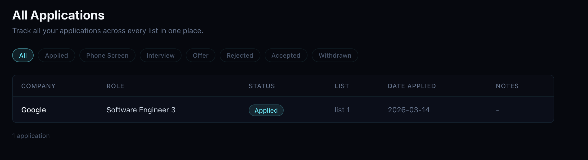
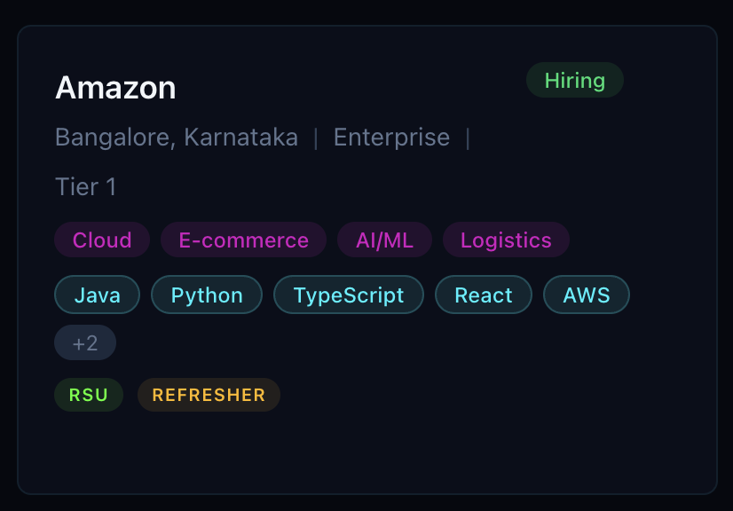
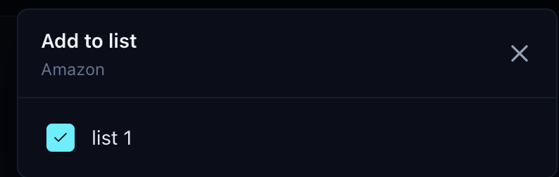

## Session 04 Feedback

Use this as an implementation-oriented follow-up to the Session 03 feedback. The main focus here is improving application filtering, company card metadata, and the list-management interaction model.

## Requested Updates

### 1. Add a company filter on the applications page

Issue:
- The applications page needs a filter by company.

Expected result:
- Add a company filter that lets the user select from companies that already have one or more applications.
- The filter should not show companies with zero applications.
- This should work alongside the existing application filters.

### 2. Improve company card chip layout and list visibility

Requested card updates:
- Keep the `RSU / Refreshers` chip anchored to the bottom of the card.
- Show office mode directly on the card as visible metadata: `Remote`, `Hybrid`, or `On-site`.
- Keep the list-action indicator always visible to the right of the office mode chip.

List-action indicator behavior:
- If the company is not part of any list, show a `+` chip.
- If the company belongs to one or more lists, show a numeric chip with the count of lists it belongs to.
- The chip should make it obvious that the card supports quick list management.

### 3. Refine the add-to-list modal interaction

Requested interaction:
- Place the list action button on the far right side of each list row.
- Use a compact single-icon button style.
- The button should represent both current state and next action.

Expected state behavior:
- When the company is not in the list:
- Show an empty circle by default.
- Show a green `+` on hover.
- On click, transition to a green circular checkmark.
- When the company is already in the list:
- Show a green circular checkmark by default.
- Show a red `x` on hover.
- On click, remove the company from the list and return to the empty-circle state.

### 4. Keep the header fixed during fast upward scroll

Issue:
- When scrolling quickly back to the top in the browser, the header shows a bounce-back effect.
- That motion should not happen on the header itself.

Expected result:
- Keep the header fixed and stable during scroll.
- Any bounce, overscroll, or elastic effect should be limited to the page body or scrollable content area, not the header.
- The header should feel anchored even when the user scrolls aggressively to the top.

## Implementation Issues

### 1. Fix duplicate React key errors in the companies page

Observed devtools error:
- `Encountered two children with the same key, 019ceb3d-e754-7553-a8bc-763a87c2e2af`

Context:
- The error is being reported from `src/app/(public)/companies/page.tsx`
- The stack trace points to the mapped children rendered around line 172.
- 40 such issues encountered.

Expected result:
- Ensure every rendered child in that list has a unique and stable key.
- Investigate why duplicate company records or duplicate IDs are reaching the UI.
- Fix the issue at the correct layer: either deduplicate the data before render or use the correct unique identifier for the rendered collection.
- This should eliminate React reconciliation issues such as duplicated or omitted items.

## Deferred Structural Work

These are deferred items from Session 03 that require schema or table changes:

- Implement the deferred changes now rather than postponing them further.
- Because the app is not yet in production, schema-level fixes should be safe to make now.
- Prefer fixing the underlying data model cleanly instead of adding temporary UI workarounds.
