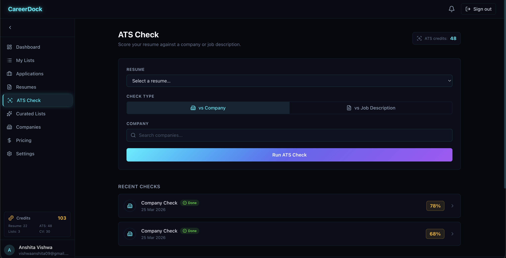
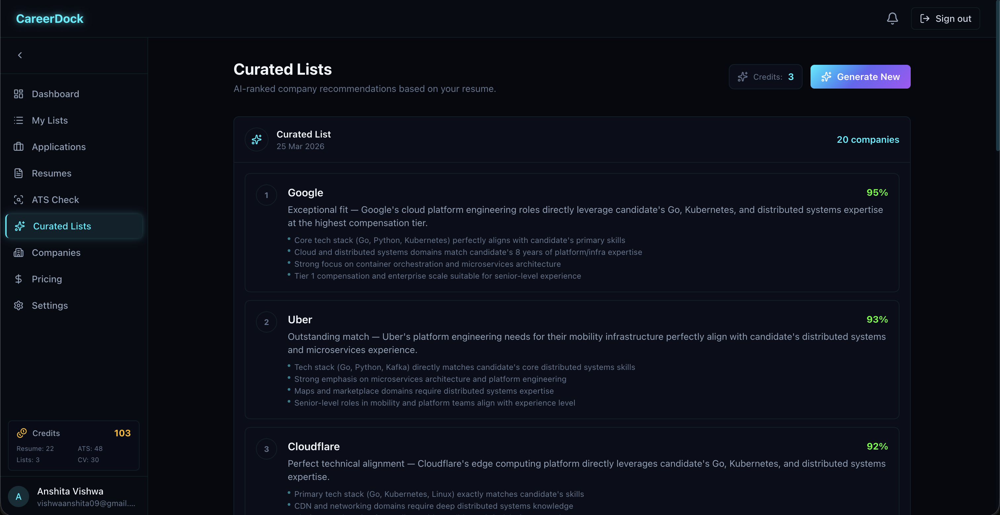
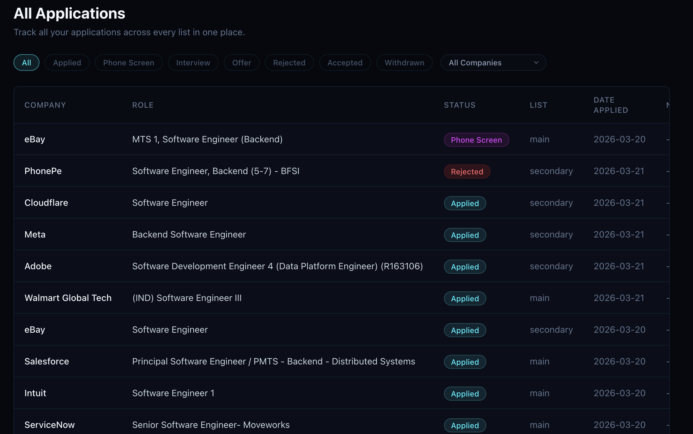
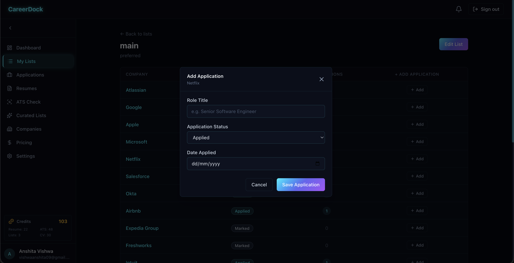

## Session 06 Feedback

Use this as an implementation-oriented cleanup pass for ATS history, curated lists, table behavior, application modeling, and moderator tooling.

## Requested Updates

### 1. ATS history should show company context and support resume-only checks

Issues:
- Previous ATS check history does not show the company the check was run against.
- If the ATS check used a job description, the company name associated with that job description should still be visible in history.
- There is no quick way to run an ATS check against only a resume.

Expected result:
- Every ATS history entry should show enough context to understand what was checked.
- If the check was based on a company job description, show the company name clearly in the history row.
- Add a resume-only ATS check mode where the user can either select an existing resume slot or upload a temporary resume just to receive ATS score and feedback.

### 2. Curated lists need management actions and user-list handoff

Issues:
- Curated lists do not expose useful management actions.
- There is no obvious way to update a curated list, delete it, or add companies from it into a user-managed list.
- Curated list names are not editable.

Expected result:
- Add visible actions for updating and deleting curated lists where appropriate.
- Allow users to add companies from a curated list into their own managed lists through a clear `+` or similar quick action.
- Allow curated list names to be edited.

### 3. Tables need horizontal scrolling support

Issue:
- Tables on the applications page, lists page, and similar screens do not allow horizontal scrolling, which causes content to be cut off.

Expected result:
- Enable horizontal scrolling anywhere table width exceeds the viewport or container width.
- Make sure wide tables remain usable on smaller screens and constrained layouts.

### 4. Applications must be modeled at the company level, not per list

Issues:
- Applications are still not behaving as intended.
- The current experience appears to allow only one application per list, which is the wrong model.
- The same company should not end up with list-specific copies of the same application state.

Domain rule:
- Applications are child records of a company.
- Lists only organize companies for tracking.
- Different lists should expose different views of the same company and its applications, not maintain separate application entities.

Expected result:
- A company should be able to have multiple applications regardless of which lists it belongs to.
- Application state should be shared at the company level across the product.
- Lists should reflect company tracking and surface existing application data, not create parallel application state.

## Moderator Tooling

### 1. Add moderator identity and actionable moderation workflows

Issues:
- Moderators need visible identifiers in the UI.
- The current UI does not provide actionable moderator flows.

Expected result:
- Show clear moderator identity or role indicators where relevant.
- Give admins and moderators the ability to add companies that are not already in the system by entering a company name and generating a draft profile using OpenAI or Claude.
- Before submission, allow the moderator to review, confirm, or edit the generated company details.
- Once approved, the company should be added to the shared company directory.

### 2. Add controlled moderator editing for company records

Issues:
- Moderators should be able to edit company information, but concurrent edits need coordination.

Expected result:
- Allow moderators to edit company details.
- Only one moderator should actively edit a given company at a time.
- If a moderator has recently submitted a change with a diff, enforce a 10-minute cooldown before another moderator can edit that same company again.
