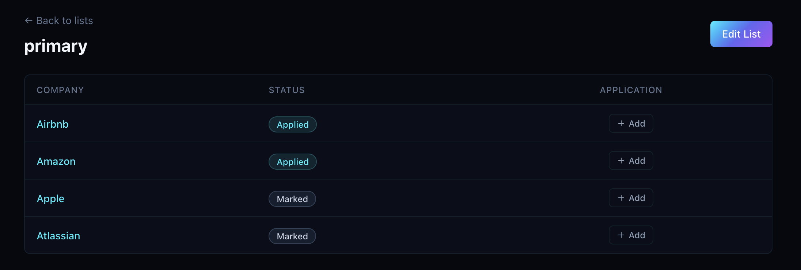
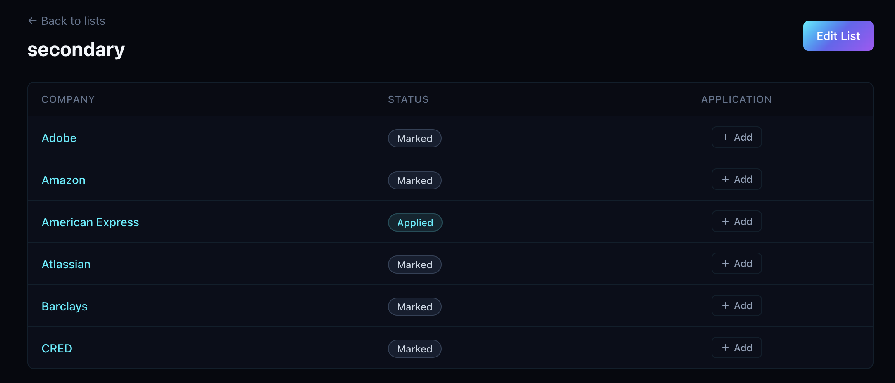
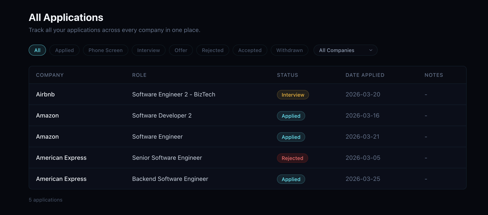
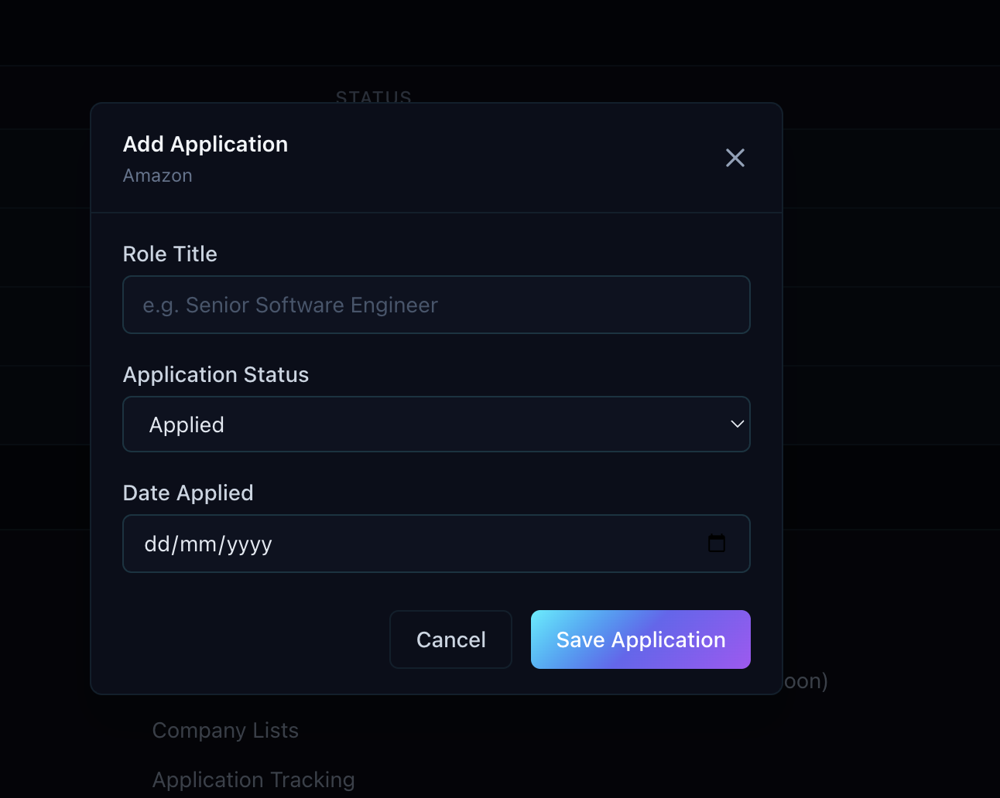

## Session 07 Feedback

Use this as an implementation-oriented follow-up focused on company-level status consistency and application creation from the applications page.

## Requested Updates

### 1. Company status must stay in sync across lists

Issues:
- Company status does not sync across different lists. (e.g. see Amazon)
- Company status should be a shared company-level value, not something that diverges per list.

Expected result:
- Keep company status as a common company-level field across the product.
- If a company appears in multiple lists, each list should reflect the same current company status.

List column requirement:
- Add a column that shows the total number of applications submitted for the company, regardless of which list the company was added from.
- Render that value as a chip.
- Clicking the chip should open the applications page with the selected company already applied as a filter.

### 2. Applications page needs a proper add-application flow

Issues:
- The applications page needs an `Add Application` action that opens a modal form.
- The form should allow selecting a company and filling out the relevant application details.
- The current form is missing a notes field.

Expected result:
- Add an `Add Application` CTA on the applications page.
- Opening the CTA should show a modal for creating a single application.
- The modal should include a company selector and the other required application fields.
- Include a notes field in the form.

Domain rule:
- Applications belong to companies.
- The applications page should make it easy to create and track applications independently of which lists the company appears in.
