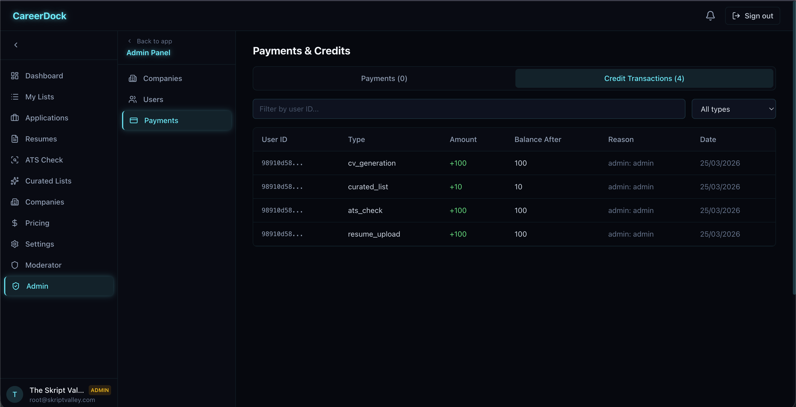
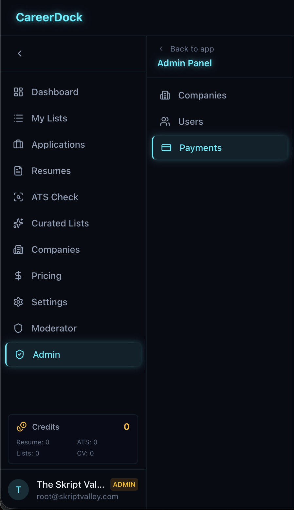
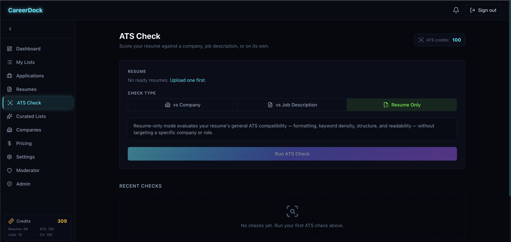
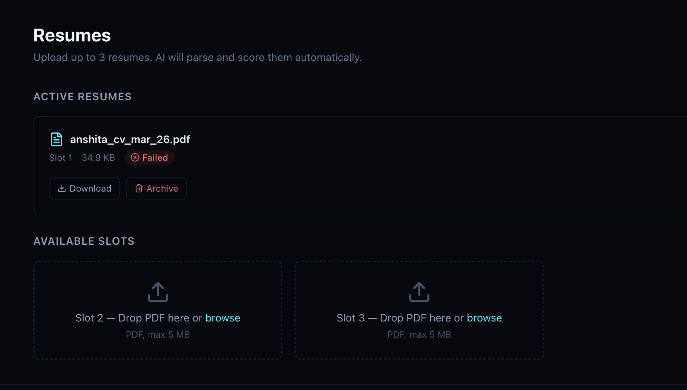

## Session 08 Feedback

Follow-up session focused on credit widget staleness, admin bootstrapping, resume processing failures, and ATS UX improvements.

---

## Reported Issues

### 1. Credit widget in sidebar is stale / delayed

Issues:
- The credit widget in the left sidebar takes too long to appear after login.
- Even once visible, it shows stale/wrong data (e.g. "Credits: 0") until the user hard-refreshes the page.
- The admin panel Payments page confirms credit transactions exist (4 entries: `cv_generation +100`, `curated_list +10`, `ats_check +100`, `resume_upload +100`), but the sidebar widget doesn't reflect the balance.

Root cause hypothesis:
- `staleTime` on the credit balance query may be too long, causing the cached empty state to persist across navigations.
- The credit balance may not be invalidated after admin credit allocation mutations.
- The widget may not re-fetch when the user navigates between routes in the dashboard SPA.

Expected result:
- Sidebar credit widget shows accurate, up-to-date balance immediately after login and after any credit-relevant action.
- Admin credit allocation must invalidate the target user's credit balance cache (this is a server-side change — the user whose credits were modified doesn't get an automatic cache bust today).
- Consider subscribing the widget to SSE credit events or using a shorter `staleTime` (e.g. 30s) for the balance query.

---

### 2. Admin account should be bootstrapped as a premium user with seed credits

Issues:
- When the admin user is created via the `ADMIN_*` env vars on first start, the account starts as a regular free-tier user (no `premium_since`, credits = 0).
- Admin/internal accounts should not be gated by the free tier — they need full access to all features for testing.

Expected result:
- The admin seed step in `dev.sh` (and equivalently in any production first-boot seed) should:
  - Set `premium_since = NOW()` on the admin user row.
  - Insert initial credit allocations: `resume_upload: 100`, `ats_check: 100`, `curated_list: 100`, `cv_generation: 100` (matching the amounts seen in the credit transaction log).
  - Record these as credit transactions with `reason = "admin: seed"` so the audit trail is clean.

---

### 3. Resume Only ATS check should allow a temporary resume upload, not require a pre-uploaded slot

Issues:
- The **Resume Only** check type displays "No ready resumes. Upload one first." when no slot-based resumes are in `ready` status.
- This blocks users who want to quickly run a general ATS scan on a new/different version of their resume without consuming a permanent slot.

Expected result:
- For the **Resume Only** mode specifically, add an inline PDF upload zone directly on the ATS Check page.
- The uploaded file is used transiently — it is NOT stored in a resume slot, does NOT count against the slot limit, and is NOT persisted beyond the check itself.
- The file should be sent directly to the ATS worker (or API endpoint) as a multipart upload, scored, and then discarded (or stored ephemerally with a short TTL).
- The existing "select from slots" flow remains for users who have ready resumes — the inline upload is an additional option, not a replacement.

Implementation notes:
- A new endpoint may be needed: `POST /api/ats/resume-only/upload` accepting a multipart PDF + triggering the general ATS check without creating a resume row.
- Alternatively, reuse the existing ATS endpoint but skip the resume DB lookup when a raw PDF is provided.
- Credit deduction still applies (1 ATS check credit).

---

### 4. ATS checks are failing — resume processing pipeline broken

Issues:
- Uploaded resumes are showing `status = failed` (seen: `anshita_cv_mar_26.pdf`, 34.9 KB, Slot 1, **Failed**).
- Because the resume never reaches `ready` status, the ATS Check page cannot run any check type (including Resume Only).
- This appears to be a worker-level failure in the `resume:parse_and_score` task.

Investigation points:
- Check worker logs for errors during PDF extraction (`pdfcpu`) or AI parsing (Claude/OpenAI).
- The PDF may have no extractable text (scanned/image-based), but the worker should still mark the resume as `failed` with a clear reason rather than silently dying.
- Verify the MinIO/S3 bucket is accessible from the worker container and the PDF download URL resolves correctly.
- Check if the Claude API key is set and working — a missing or expired key would cause every AI call to fail, setting the resume to `failed`.
- Confirm the worker is running and connected to Redis (Asynq queue) — if the task is enqueued but never consumed, the resume stays in `processing` and could time out to `failed`.

Expected result:
- Resume processing should succeed for standard text-based PDFs.
- If processing fails, the `failed` reason should be stored and surfaced in the UI (tooltip or expandable error message on the resume card).
- Worker should log structured errors with enough context (resume ID, user ID, failure stage: download / extract / parse / score) to diagnose quickly.
- Add a **Retry** action on failed resumes in the UI (re-enqueues the `resume:parse_and_score` task).

---

## Screenshot Index

| File | Issue |
|------|-------|
| `session-08-admin-credit-transactions.png` | Admin payments tab showing 4 credit transactions (cv_generation, curated_list, ats_check, resume_upload) — proves credits exist server-side while sidebar shows 0 |
| `session-08-admin-mobile-sidebar-zero-credits.png` | Mobile view of admin panel sidebar — "Credits: 0" despite active transactions; illustrates stale widget |
| `session-08-ats-check-no-ready-resume.png` | ATS Check page in Resume Only mode — "No ready resumes. Upload one first." blocking the flow |
| `session-08-resume-failed-status.png` | Resumes page — `anshita_cv_mar_26.pdf` in Slot 1 showing **Failed** badge; root cause of ATS failure |
