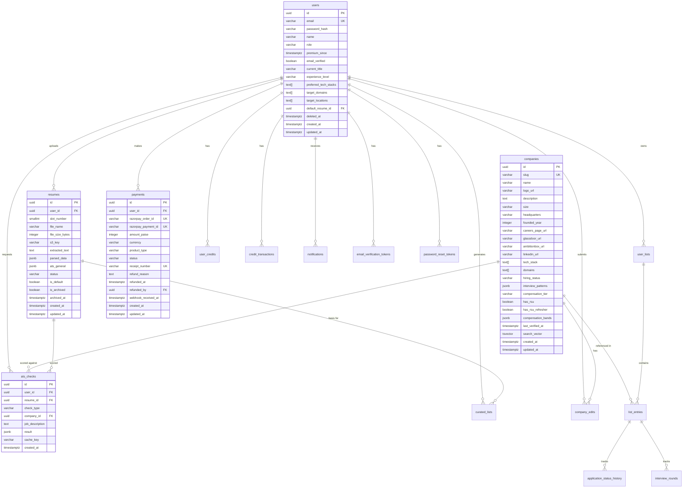

# CareerDock — Database Design (LLD)

> **Version:** 1.0
> **Status:** Draft (Phase 3)
> **Last updated:** 2026-03-11
> **Depends on:** [PRD.md](../PRD.md), [ARCHITECTURE.md](../ARCHITECTURE.md)

---

## 1. Design Decisions

### 1.1 Primary Keys — UUID v7

All tables use UUID v7 primary keys.

| Consideration | Decision |
|---------------|----------|
| Format | UUID v7 (RFC 9562) — time-sortable |
| Go library | `google/uuid` (supports v7 since v1.6) |
| Why not serial/bigint | Prevents ID enumeration, safe for URLs, no sequence contention |
| Why v7 over v4 | Time-ordered UUIDs have better B-tree locality — inserts go to the right edge, reducing page splits. Natural chronological ordering without needing `created_at` in ORDER BY |
| Performance impact | Negligible at MVP scale. 16 bytes vs 8 bytes (bigint) — ~50KB extra per 10K rows |

### 1.2 Enum Strategy — VARCHAR + CHECK Constraints

PostgreSQL native enums (`CREATE TYPE ... AS ENUM`) are type-safe but adding values requires `ALTER TYPE`, which complicates migrations. Instead:

- All enum-like columns use `VARCHAR` with `CHECK` constraints.
- Go code defines corresponding `const` values for compile-time safety.
- Adding a new enum value = new migration with `ALTER TABLE ... DROP CONSTRAINT ... ADD CONSTRAINT`.

### 1.3 Timestamps

- All timestamp columns use `TIMESTAMPTZ` (timezone-aware).
- `created_at` and `updated_at` default to `NOW()`.
- `updated_at` is maintained by the application layer (not DB triggers — keeps logic in Go).

### 1.4 Soft Delete

Only `users` have soft delete (PRD: 30-day grace period, then hard delete):
- `deleted_at TIMESTAMPTZ NULL` — null means active.
- A scheduled job (cron or Asynq periodic task) hard-deletes users where `deleted_at < NOW() - INTERVAL '30 days'`.
- Hard delete cascades: resumes (S3 cleanup), lists, credits, etc.

All other entities use hard delete or status flags (e.g., company edits have a `status` column).

### 1.5 User Roles vs Premium Status

Decoupled — a moderator can also be premium:

- `role VARCHAR CHECK (role IN ('user', 'moderator', 'admin'))` — permission hierarchy.
- `premium_since TIMESTAMPTZ NULL` — null = free user, non-null = has purchased Starter Pack.
- List limits derived in service layer: `premium_since IS NOT NULL` → 5 lists, else 3.

### 1.6 Money — Paise as INTEGER

Razorpay operates in paise (100 paise = ₹1). All monetary amounts stored as `INTEGER` in paise. Display conversion happens in the frontend/handler layer.

---

## 2. Entity-Relationship Diagram



---

## 3. Table Definitions

### 3.1 `users`

Stores all registered users — free, premium, moderator, and admin.

```sql
CREATE TABLE users (
    id              UUID PRIMARY KEY DEFAULT gen_random_uuid(),
    email           VARCHAR(255) NOT NULL,
    password_hash   VARCHAR(255) NOT NULL,
    name            VARCHAR(255) NOT NULL,
    role            VARCHAR(20)  NOT NULL DEFAULT 'user'
                        CHECK (role IN ('user', 'moderator', 'admin')),
    premium_since   TIMESTAMPTZ,
    email_verified  BOOLEAN      NOT NULL DEFAULT FALSE,

    -- Profile fields (used for AI matching)
    current_title       VARCHAR(255),
    experience_level    VARCHAR(20)
                            CHECK (experience_level IN (
                                'fresher', 'junior', 'mid', 'senior', 'staff_plus'
                            )),
    preferred_tech_stacks TEXT[]   DEFAULT '{}',
    target_domains        TEXT[]   DEFAULT '{}',
    target_locations      TEXT[]   DEFAULT '{}',

    -- Default resume for AI-curated lists and ATS pre-selection
    default_resume_id UUID,

    -- Soft delete
    deleted_at TIMESTAMPTZ,

    created_at TIMESTAMPTZ NOT NULL DEFAULT NOW(),
    updated_at TIMESTAMPTZ NOT NULL DEFAULT NOW(),

    CONSTRAINT uq_users_email UNIQUE (email)
);

-- FK to resumes added after resumes table is created (circular reference)
-- ALTER TABLE users ADD CONSTRAINT fk_users_default_resume
--     FOREIGN KEY (default_resume_id) REFERENCES resumes(id) ON DELETE SET NULL;
```

**Indexes:**

```sql
-- Login lookup
CREATE UNIQUE INDEX idx_users_email ON users (email);

-- Admin user management (filter by role, sort by creation)
CREATE INDEX idx_users_role_created ON users (role, created_at DESC);

-- Scheduled cleanup of soft-deleted users
CREATE INDEX idx_users_deleted_at ON users (deleted_at)
    WHERE deleted_at IS NOT NULL;
```

---

### 3.2 `companies`

The company directory — admin-curated, publicly browsable.

```sql
CREATE TABLE companies (
    id                  UUID PRIMARY KEY DEFAULT gen_random_uuid(),
    slug                VARCHAR(255) NOT NULL,
    name                VARCHAR(255) NOT NULL,
    logo_url            VARCHAR(512),
    description         TEXT,
    size                VARCHAR(20)
                            CHECK (size IN (
                                'startup', 'small', 'mid', 'large', 'enterprise'
                            )),
    headquarters        VARCHAR(255),
    founded_year        INTEGER
                            CHECK (founded_year >= 1900 AND founded_year <= 2100),
    careers_page_url    VARCHAR(512),
    glassdoor_url       VARCHAR(512),
    ambitionbox_url     VARCHAR(512),
    linkedin_url        VARCHAR(512),
    tech_stack          TEXT[]       NOT NULL DEFAULT '{}',
    domains             TEXT[]       NOT NULL DEFAULT '{}',
    hiring_status       VARCHAR(20)  NOT NULL DEFAULT 'unknown'
                            CHECK (hiring_status IN ('active', 'paused', 'unknown')),
    interview_patterns  JSONB,
    compensation_tier   VARCHAR(10)
                            CHECK (compensation_tier IN (
                                'tier_1', 'tier_2', 'tier_3', 'tier_4'
                            )),
    has_rsu             BOOLEAN      NOT NULL DEFAULT FALSE,
    has_rsu_refresher   BOOLEAN      NOT NULL DEFAULT FALSE,
    compensation_bands  JSONB,
    last_verified_at    TIMESTAMPTZ,

    -- Full-text search vector (auto-maintained)
    search_vector TSVECTOR GENERATED ALWAYS AS (
        setweight(to_tsvector('english', coalesce(name, '')), 'A') ||
        setweight(to_tsvector('english', coalesce(description, '')), 'B') ||
        setweight(to_tsvector('english', coalesce(array_to_string(tech_stack, ' '), '')), 'B') ||
        setweight(to_tsvector('english', coalesce(array_to_string(domains, ' '), '')), 'C')
    ) STORED,

    created_at TIMESTAMPTZ NOT NULL DEFAULT NOW(),
    updated_at TIMESTAMPTZ NOT NULL DEFAULT NOW(),

    CONSTRAINT uq_companies_slug UNIQUE (slug)
);
```

**Indexes:**

```sql
-- Full-text search
CREATE INDEX idx_companies_search ON companies USING GIN (search_vector);

-- Array containment filters ("companies using Go" → tech_stack @> '{Go}')
CREATE INDEX idx_companies_tech_stack ON companies USING GIN (tech_stack);
CREATE INDEX idx_companies_domains ON companies USING GIN (domains);

-- Common filter columns
CREATE INDEX idx_companies_hiring_status ON companies (hiring_status);
CREATE INDEX idx_companies_compensation_tier ON companies (compensation_tier);
CREATE INDEX idx_companies_size ON companies (size);

-- Slug lookup (already covered by UNIQUE constraint)
-- Sorting by update time
CREATE INDEX idx_companies_updated_at ON companies (updated_at DESC);
```

---

### 3.3 `company_edits`

Moderation queue for moderator-suggested edits to company profiles.

```sql
CREATE TABLE company_edits (
    id              UUID PRIMARY KEY DEFAULT gen_random_uuid(),
    company_id      UUID         NOT NULL REFERENCES companies(id) ON DELETE CASCADE,
    submitted_by    UUID         NOT NULL REFERENCES users(id) ON DELETE CASCADE,
    reviewed_by     UUID         REFERENCES users(id) ON DELETE SET NULL,
    status          VARCHAR(20)  NOT NULL DEFAULT 'pending'
                        CHECK (status IN ('pending', 'approved', 'rejected')),
    changes         JSONB        NOT NULL,  -- proposed field changes as key-value pairs
    review_notes    TEXT,
    reviewed_at     TIMESTAMPTZ,
    created_at      TIMESTAMPTZ  NOT NULL DEFAULT NOW()
);
```

**Indexes:**

```sql
-- Admin moderation queue: pending edits sorted by submission time
CREATE INDEX idx_company_edits_pending ON company_edits (created_at ASC)
    WHERE status = 'pending';

-- Edits for a specific company
CREATE INDEX idx_company_edits_company ON company_edits (company_id, created_at DESC);

-- Edits by a specific moderator
CREATE INDEX idx_company_edits_submitter ON company_edits (submitted_by, created_at DESC);
```

---

### 3.4 `user_lists`

User-created company tracking lists.

```sql
CREATE TABLE user_lists (
    id          UUID PRIMARY KEY DEFAULT gen_random_uuid(),
    user_id     UUID         NOT NULL REFERENCES users(id) ON DELETE CASCADE,
    name        VARCHAR(255) NOT NULL,
    description TEXT,
    position    INTEGER      NOT NULL DEFAULT 0,  -- display ordering
    created_at  TIMESTAMPTZ  NOT NULL DEFAULT NOW(),
    updated_at  TIMESTAMPTZ  NOT NULL DEFAULT NOW()
);
```

**Indexes:**

```sql
-- User's lists ordered by position
CREATE INDEX idx_user_lists_user ON user_lists (user_id, position ASC);
```

**List limit enforcement:** Not enforced at DB level. Service layer checks count before insert:
- Free users (`premium_since IS NULL`): max 3 lists.
- Premium users: max 5 lists.

---

### 3.5 `list_entries`

Each entry is a company + role pair within a list, with application tracking.

```sql
CREATE TABLE list_entries (
    id          UUID PRIMARY KEY DEFAULT gen_random_uuid(),
    list_id     UUID         NOT NULL REFERENCES user_lists(id) ON DELETE CASCADE,
    company_id  UUID         NOT NULL REFERENCES companies(id) ON DELETE CASCADE,
    role_title  VARCHAR(255) NOT NULL,
    status      VARCHAR(20)  NOT NULL DEFAULT 'not_applied'
                    CHECK (status IN (
                        'not_applied', 'applied', 'phone_screen', 'interview',
                        'offer', 'rejected', 'accepted', 'withdrawn'
                    )),
    date_applied DATE,
    notes        TEXT,
    position     INTEGER     NOT NULL DEFAULT 0,  -- ordering within list
    created_at   TIMESTAMPTZ NOT NULL DEFAULT NOW(),
    updated_at   TIMESTAMPTZ NOT NULL DEFAULT NOW()
);
```

**Indexes:**

```sql
-- Entries in a list, ordered
CREATE INDEX idx_list_entries_list ON list_entries (list_id, position ASC);

-- Find all entries for a company across lists (useful for company profile context)
CREATE INDEX idx_list_entries_company ON list_entries (company_id);
```

---

### 3.6 `application_status_history`

Audit trail for every status change on a list entry.

```sql
CREATE TABLE application_status_history (
    id              UUID PRIMARY KEY DEFAULT gen_random_uuid(),
    list_entry_id   UUID        NOT NULL REFERENCES list_entries(id) ON DELETE CASCADE,
    from_status     VARCHAR(20),  -- NULL for initial status
    to_status       VARCHAR(20) NOT NULL,
    changed_at      TIMESTAMPTZ NOT NULL DEFAULT NOW()
);
```

**Indexes:**

```sql
-- History for a specific entry, chronological
CREATE INDEX idx_status_history_entry ON application_status_history (list_entry_id, changed_at ASC);
```

---

### 3.7 `interview_rounds`

Per-application interview round tracking.

```sql
CREATE TABLE interview_rounds (
    id              UUID PRIMARY KEY DEFAULT gen_random_uuid(),
    list_entry_id   UUID         NOT NULL REFERENCES list_entries(id) ON DELETE CASCADE,
    round_number    SMALLINT     NOT NULL CHECK (round_number > 0),
    round_type      VARCHAR(100) NOT NULL,  -- HR, Technical, System Design, Managerial, etc.
    scheduled_date  DATE,
    outcome         VARCHAR(20)  NOT NULL DEFAULT 'pending'
                        CHECK (outcome IN ('passed', 'failed', 'pending')),
    notes           TEXT,
    created_at      TIMESTAMPTZ  NOT NULL DEFAULT NOW(),
    updated_at      TIMESTAMPTZ  NOT NULL DEFAULT NOW()
);
```

**Indexes:**

```sql
-- Rounds for a specific entry, ordered by round number
CREATE INDEX idx_interview_rounds_entry ON interview_rounds (list_entry_id, round_number ASC);
```

---

### 3.8 `resumes`

Resume metadata, extracted text, AI-parsed structured data, and general ATS score. S3 is archival only — all operational data lives here.

```sql
CREATE TABLE resumes (
    id              UUID PRIMARY KEY DEFAULT gen_random_uuid(),
    user_id         UUID         NOT NULL REFERENCES users(id) ON DELETE CASCADE,
    slot_number     SMALLINT     NOT NULL CHECK (slot_number BETWEEN 1 AND 3),
    file_name       VARCHAR(255) NOT NULL,
    file_size_bytes INTEGER      NOT NULL CHECK (file_size_bytes > 0 AND file_size_bytes <= 5242880),
    s3_key          VARCHAR(512) NOT NULL,

    -- Extracted and parsed content (Postgres-first strategy)
    extracted_text  TEXT,                    -- raw text from PDF extraction
    parsed_data     JSONB,                   -- AI-extracted structured data (skills, experience, etc.)
    ats_general     JSONB,                   -- general ATS score result (score, breakdown, suggestions)

    -- Processing status
    status          VARCHAR(20)  NOT NULL DEFAULT 'uploading'
                        CHECK (status IN (
                            'uploading', 'extracting', 'parsing', 'ready', 'failed'
                        )),
    is_default      BOOLEAN      NOT NULL DEFAULT FALSE,

    -- Archival (re-upload replaces a slot, old resume is archived)
    is_archived     BOOLEAN      NOT NULL DEFAULT FALSE,
    archived_at     TIMESTAMPTZ,

    created_at TIMESTAMPTZ NOT NULL DEFAULT NOW(),
    updated_at TIMESTAMPTZ NOT NULL DEFAULT NOW()
);

-- Add the deferred FK from users → resumes
ALTER TABLE users ADD CONSTRAINT fk_users_default_resume
    FOREIGN KEY (default_resume_id) REFERENCES resumes(id) ON DELETE SET NULL;
```

**Indexes:**

```sql
-- User's resumes
CREATE INDEX idx_resumes_user ON resumes (user_id, created_at DESC);

-- Active slot uniqueness: only one non-archived resume per user per slot
CREATE UNIQUE INDEX idx_resumes_active_slot ON resumes (user_id, slot_number)
    WHERE NOT is_archived;

-- At most one default resume per user (among active resumes)
CREATE UNIQUE INDEX idx_resumes_default ON resumes (user_id)
    WHERE is_default = TRUE AND NOT is_archived;
```

---

### 3.9 `ats_checks`

Log of company-specific and job-specific ATS checks.

```sql
CREATE TABLE ats_checks (
    id              UUID PRIMARY KEY DEFAULT gen_random_uuid(),
    user_id         UUID         NOT NULL REFERENCES users(id) ON DELETE CASCADE,
    resume_id       UUID         NOT NULL REFERENCES resumes(id) ON DELETE CASCADE,
    check_type      VARCHAR(10)  NOT NULL
                        CHECK (check_type IN ('company', 'job')),
    company_id      UUID         REFERENCES companies(id) ON DELETE SET NULL,  -- for company checks
    job_description TEXT,                                                       -- for job checks
    result          JSONB        NOT NULL,  -- score, breakdown, suggestions, gap analysis
    cache_key       VARCHAR(255) NOT NULL,  -- sha256 hash for deduplication
    created_at      TIMESTAMPTZ  NOT NULL DEFAULT NOW(),

    -- Ensure company_id is set for company checks, job_description for job checks
    CONSTRAINT chk_ats_check_target CHECK (
        (check_type = 'company' AND company_id IS NOT NULL) OR
        (check_type = 'job' AND job_description IS NOT NULL)
    )
);
```

**Indexes:**

```sql
-- User's ATS check history
CREATE INDEX idx_ats_checks_user ON ats_checks (user_id, created_at DESC);

-- Cache key lookup (find existing result to avoid re-computation)
CREATE INDEX idx_ats_checks_cache_key ON ats_checks (cache_key);

-- Company ATS checks (for "how many users scored against this company" analytics)
CREATE INDEX idx_ats_checks_company ON ats_checks (company_id, created_at DESC)
    WHERE company_id IS NOT NULL;
```

---

### 3.10 `curated_lists`

AI-generated company recommendation results. These are read-only reports, not editable lists.

```sql
CREATE TABLE curated_lists (
    id                UUID PRIMARY KEY DEFAULT gen_random_uuid(),
    user_id           UUID         NOT NULL REFERENCES users(id) ON DELETE CASCADE,
    resume_id         UUID         NOT NULL REFERENCES resumes(id) ON DELETE CASCADE,
    preferences_hash  VARCHAR(64)  NOT NULL,  -- sha256 of user prefs used for generation
    result            JSONB        NOT NULL,   -- ranked companies with scores and reasoning
    created_at        TIMESTAMPTZ  NOT NULL DEFAULT NOW()
);
```

**Indexes:**

```sql
-- User's curated list history (most recent first)
CREATE INDEX idx_curated_lists_user ON curated_lists (user_id, created_at DESC);
```

---

### 3.11 `payments`

Razorpay transaction log. One row per purchase attempt.

```sql
CREATE TABLE payments (
    id                  UUID PRIMARY KEY DEFAULT gen_random_uuid(),
    user_id             UUID         NOT NULL REFERENCES users(id) ON DELETE CASCADE,
    razorpay_order_id   VARCHAR(255) NOT NULL,
    razorpay_payment_id VARCHAR(255),          -- NULL until payment is captured
    amount_paise        INTEGER      NOT NULL CHECK (amount_paise > 0),
    currency            VARCHAR(3)   NOT NULL DEFAULT 'INR',
    product_type        VARCHAR(30)  NOT NULL
                            CHECK (product_type IN (
                                'starter_pack', 'resume_upload', 'ats_bundle',
                                'cv_generation', 'rebuy_pack'
                            )),
    status              VARCHAR(20)  NOT NULL DEFAULT 'created'
                            CHECK (status IN ('created', 'captured', 'failed', 'refunded')),
    receipt_number      VARCHAR(100),

    -- Refund tracking
    refund_reason       TEXT,
    refunded_at         TIMESTAMPTZ,
    refunded_by         UUID         REFERENCES users(id) ON DELETE SET NULL,  -- admin

    webhook_received_at TIMESTAMPTZ,
    created_at          TIMESTAMPTZ  NOT NULL DEFAULT NOW(),
    updated_at          TIMESTAMPTZ  NOT NULL DEFAULT NOW(),

    CONSTRAINT uq_payments_razorpay_order  UNIQUE (razorpay_order_id),
    CONSTRAINT uq_payments_razorpay_payment UNIQUE (razorpay_payment_id),
    CONSTRAINT uq_payments_receipt         UNIQUE (receipt_number)
);
```

**Indexes:**

```sql
-- User's payment history
CREATE INDEX idx_payments_user ON payments (user_id, created_at DESC);

-- Admin: filter by status
CREATE INDEX idx_payments_status ON payments (status, created_at DESC);
```

**Note:** `razorpay_order_id` UNIQUE constraint serves as the idempotency key — duplicate webhook deliveries are detected by the existing row.

---

### 3.12 `user_credits`

Current credit balance per type. One row per user per credit type.

```sql
CREATE TABLE user_credits (
    id          UUID PRIMARY KEY DEFAULT gen_random_uuid(),
    user_id     UUID        NOT NULL REFERENCES users(id) ON DELETE CASCADE,
    credit_type VARCHAR(20) NOT NULL
                    CHECK (credit_type IN (
                        'resume_upload', 'ats_check', 'curated_list', 'cv_generation'
                    )),
    balance     INTEGER     NOT NULL DEFAULT 0 CHECK (balance >= 0),
    updated_at  TIMESTAMPTZ NOT NULL DEFAULT NOW(),

    CONSTRAINT uq_user_credits UNIQUE (user_id, credit_type)
);
```

**No additional indexes needed** — the UNIQUE constraint on `(user_id, credit_type)` covers all lookups.

**Credit allocation on Starter Pack purchase:**

| Credit Type | Quantity |
|-------------|----------|
| `resume_upload` | 9 (3 initial + 6 re-uploads) |
| `ats_check` | 20 (10 company + 10 job — fungible) |
| `curated_list` | 3 |

---

### 3.13 `credit_transactions`

Full audit trail for every credit change. Immutable — insert only.

```sql
CREATE TABLE credit_transactions (
    id            UUID PRIMARY KEY DEFAULT gen_random_uuid(),
    user_id       UUID         NOT NULL REFERENCES users(id) ON DELETE CASCADE,
    credit_type   VARCHAR(20)  NOT NULL
                      CHECK (credit_type IN (
                          'resume_upload', 'ats_check', 'curated_list', 'cv_generation'
                      )),
    amount        INTEGER      NOT NULL,  -- positive = credit, negative = debit
    balance_after INTEGER      NOT NULL,  -- snapshot of balance after this transaction
    reason        VARCHAR(100) NOT NULL,  -- e.g., 'starter_pack_purchase', 'ats_check_consumed', 'admin_refund'
    reference_id  UUID,                    -- optional FK to payment, ats_check, resume, etc.
    created_at    TIMESTAMPTZ  NOT NULL DEFAULT NOW()
);
```

**Indexes:**

```sql
-- User's transaction history
CREATE INDEX idx_credit_txns_user ON credit_transactions (user_id, created_at DESC);

-- Transactions by type for analytics
CREATE INDEX idx_credit_txns_type ON credit_transactions (credit_type, created_at DESC);
```

---

### 3.14 `feature_flags`

Platform-wide feature toggles, admin-controlled.

```sql
CREATE TABLE feature_flags (
    id          UUID PRIMARY KEY DEFAULT gen_random_uuid(),
    key         VARCHAR(100) NOT NULL,
    enabled     BOOLEAN      NOT NULL DEFAULT FALSE,
    description TEXT,
    created_at  TIMESTAMPTZ  NOT NULL DEFAULT NOW(),
    updated_at  TIMESTAMPTZ  NOT NULL DEFAULT NOW(),

    CONSTRAINT uq_feature_flags_key UNIQUE (key)
);
```

**No additional indexes needed** — the UNIQUE constraint on `key` covers lookups. Feature flags are typically loaded into memory/Redis on startup and refreshed periodically.

---

### 3.15 `admin_audit_log`

Tracks all admin actions for accountability. Immutable — insert only.

```sql
CREATE TABLE admin_audit_log (
    id          UUID PRIMARY KEY DEFAULT gen_random_uuid(),
    admin_id    UUID         NOT NULL REFERENCES users(id) ON DELETE CASCADE,
    action      VARCHAR(255) NOT NULL,       -- e.g., 'user_suspended', 'company_created', 'refund_issued'
    entity_type VARCHAR(50)  NOT NULL,       -- 'user', 'company', 'payment', 'feature_flag'
    entity_id   UUID,                         -- ID of the affected entity
    details     JSONB,                        -- additional context (before/after values, etc.)
    ip_address  INET,
    created_at  TIMESTAMPTZ  NOT NULL DEFAULT NOW()
);
```

**Indexes:**

```sql
-- Audit log by admin
CREATE INDEX idx_audit_log_admin ON admin_audit_log (admin_id, created_at DESC);

-- Audit log by entity (e.g., "show all admin actions on this user")
CREATE INDEX idx_audit_log_entity ON admin_audit_log (entity_type, entity_id, created_at DESC);

-- Time-range queries for admin dashboard
CREATE INDEX idx_audit_log_created ON admin_audit_log (created_at DESC);
```

---

### 3.16 `notifications`

Persistent notifications for async job completions and system messages. SSE delivers them in real-time; this table provides history and unread tracking.

```sql
CREATE TABLE notifications (
    id          UUID PRIMARY KEY DEFAULT gen_random_uuid(),
    user_id     UUID         NOT NULL REFERENCES users(id) ON DELETE CASCADE,
    type        VARCHAR(50)  NOT NULL,  -- 'ats_result_ready', 'resume_parsed', 'curated_list_ready', 'payment_confirmed'
    title       VARCHAR(255) NOT NULL,
    message     TEXT,
    data        JSONB,                   -- e.g., {"check_id": "...", "score": 85}
    read_at     TIMESTAMPTZ,             -- NULL = unread
    created_at  TIMESTAMPTZ  NOT NULL DEFAULT NOW()
);
```

**Indexes:**

```sql
-- Unread notifications for a user (badge count, SSE reconnection catch-up)
CREATE INDEX idx_notifications_unread ON notifications (user_id, created_at DESC)
    WHERE read_at IS NULL;

-- All notifications for a user (notification history page)
CREATE INDEX idx_notifications_user ON notifications (user_id, created_at DESC);
```

---

### 3.17 `email_verification_tokens`

Single-use tokens for email verification. Expire after 24 hours.

```sql
CREATE TABLE email_verification_tokens (
    id          UUID PRIMARY KEY DEFAULT gen_random_uuid(),
    user_id     UUID         NOT NULL REFERENCES users(id) ON DELETE CASCADE,
    token       VARCHAR(255) NOT NULL,
    expires_at  TIMESTAMPTZ  NOT NULL,
    used_at     TIMESTAMPTZ,
    created_at  TIMESTAMPTZ  NOT NULL DEFAULT NOW(),

    CONSTRAINT uq_email_verification_token UNIQUE (token)
);
```

**Indexes:**

```sql
-- Token lookup (login/verification flow)
-- Covered by UNIQUE constraint on token

-- Cleanup expired tokens
CREATE INDEX idx_email_tokens_expires ON email_verification_tokens (expires_at)
    WHERE used_at IS NULL;
```

---

### 3.18 `password_reset_tokens`

Single-use tokens for password reset. Expire after 1 hour.

```sql
CREATE TABLE password_reset_tokens (
    id          UUID PRIMARY KEY DEFAULT gen_random_uuid(),
    user_id     UUID         NOT NULL REFERENCES users(id) ON DELETE CASCADE,
    token       VARCHAR(255) NOT NULL,
    expires_at  TIMESTAMPTZ  NOT NULL,
    used_at     TIMESTAMPTZ,
    created_at  TIMESTAMPTZ  NOT NULL DEFAULT NOW(),

    CONSTRAINT uq_password_reset_token UNIQUE (token)
);
```

**Indexes:**

```sql
-- Token lookup: covered by UNIQUE constraint
-- Cleanup expired tokens
CREATE INDEX idx_password_tokens_expires ON password_reset_tokens (expires_at)
    WHERE used_at IS NULL;
```

---

## 4. JSONB Schemas

These define the expected structure for JSONB columns. Validated at the application layer (Go structs with JSON tags).

### 4.1 `companies.interview_patterns`

```json
{
  "roles": [
    {
      "title": "SDE-1",
      "total_rounds": 4,
      "rounds": [
        {
          "type": "Online Assessment",
          "difficulty": "Medium",
          "topics": ["DSA", "Problem Solving"],
          "duration_minutes": 90
        }
      ],
      "typical_timeline_days": 14,
      "notes": "Optional free-text notes"
    }
  ]
}
```

### 4.2 `companies.compensation_bands`

```json
{
  "roles": [
    {
      "title": "SDE-1",
      "min_ctc_lakhs": 8,
      "max_ctc_lakhs": 15,
      "equity_component": "RSU",
      "equity_notes": "Vests over 4 years, annual refreshers",
      "currency": "INR",
      "source": "estimate",
      "last_updated": "2026-01"
    }
  ]
}
```

### 4.3 `resumes.parsed_data`

```json
{
  "name": "Sujay Kumar",
  "email": "sujay@example.com",
  "phone": "+91-XXXXX",
  "summary": "Senior backend engineer with 6 years...",
  "years_of_experience": 6,
  "skills": {
    "languages": ["Go", "Python", "TypeScript"],
    "frameworks": ["Chi", "FastAPI", "React"],
    "tools": ["Docker", "Kubernetes", "Terraform"],
    "databases": ["PostgreSQL", "Redis", "DynamoDB"],
    "cloud": ["AWS"]
  },
  "experience": [
    {
      "company": "Acme Corp",
      "title": "Senior Software Engineer",
      "start_date": "2022-01",
      "end_date": null,
      "description": "Led backend team..."
    }
  ],
  "education": [
    {
      "institution": "IIT Bombay",
      "degree": "B.Tech Computer Science",
      "year": 2018
    }
  ],
  "domains": ["Cloud", "Infra", "SaaS"],
  "role_level": "senior"
}
```

### 4.4 `resumes.ats_general`

```json
{
  "score": 78,
  "breakdown": {
    "formatting": {"score": 85, "feedback": "Clean formatting, good use of bullet points"},
    "keyword_density": {"score": 70, "feedback": "Missing common keywords: CI/CD, microservices"},
    "section_completeness": {"score": 90, "feedback": "All major sections present"},
    "readability": {"score": 80, "feedback": "Slightly long sentences in experience section"},
    "ats_parsability": {"score": 65, "feedback": "Tables may cause issues with some ATS parsers"}
  },
  "suggestions": [
    "Add CI/CD and microservices to skills section",
    "Replace tables with bullet points for better ATS compatibility",
    "Shorten experience descriptions to 2-3 bullet points each"
  ],
  "generated_at": "2026-03-11T10:30:00Z"
}
```

### 4.5 `ats_checks.result`

```json
{
  "score": 72,
  "check_type": "company",
  "target": {
    "company_id": "uuid-here",
    "company_name": "Google"
  },
  "breakdown": {
    "tech_stack_match": {"score": 85, "matched": ["Go", "Docker", "K8s"], "missing": ["C++", "gRPC"]},
    "domain_relevance": {"score": 60, "feedback": "Your SaaS experience partially aligns with their Cloud focus"},
    "experience_level": {"score": 80, "feedback": "Senior level matches SDE-3 requirements"},
    "culture_keywords": {"score": 65, "feedback": "Consider adding: scale, distributed systems, ownership"}
  },
  "best_resume": {
    "resume_id": "uuid-here",
    "file_name": "resume_v3.pdf",
    "recommendation": "This resume has the strongest tech stack match"
  },
  "suggestions": [
    "Emphasize distributed systems experience",
    "Add gRPC to skills if applicable"
  ],
  "generated_at": "2026-03-11T11:00:00Z"
}
```

### 4.6 `curated_lists.result`

```json
{
  "total_companies_evaluated": 150,
  "matches": [
    {
      "company_id": "uuid",
      "company_name": "Google",
      "match_score": 92,
      "reasoning": "Strong Go and K8s overlap, Cloud domain match, senior-level fit",
      "key_matches": ["Go", "Kubernetes", "Cloud", "Senior"],
      "gaps": ["C++ experience preferred for some teams"]
    }
  ],
  "generated_at": "2026-03-11T12:00:00Z"
}
```

---

## 5. Redis Key Patterns

These are not database tables but are part of the data architecture. Documented here for completeness.

| Purpose | Key Pattern | TTL | Type |
|---------|-------------|-----|------|
| Session store | `session:{user_id}:{jti}` | 7 days | Hash (user_id, role, premium_since, email) |
| Refresh token blacklist | `blacklist:{jti}` | 7 days | String (empty value, existence = blacklisted) |
| Rate limiting | `ratelimit:{identifier}:{endpoint}` | 1-15 min | String (counter via INCR) |
| AI result cache (company ATS) | `ats_company:{sha256(resume_text)}:{company_id}` | 30 days | String (JSON result) |
| AI result cache (job ATS) | `ats_job:{sha256(resume_text)}:{sha256(jd_text)}` | 30 days | String (JSON result) |
| AI result cache (curated list) | `curated:{sha256(resume_text)}:{prefs_hash}` | 7 days | String (JSON result) |
| SSE client registry | `sse:clients:{user_id}` | On disconnect | Set (connection IDs) |
| Feature flag cache | `flags:{key}` | 5 min | String (boolean) |

**Note:** Resume parse results and general ATS scores are stored permanently in the `resumes` table (not Redis) — they never expire.

---

## 6. Migration Strategy

### 6.1 Tool: golang-migrate

- Library: `github.com/golang-migrate/migrate/v4`
- Driver: `pgx5`
- Entry point: `cmd/migrate/main.go`

### 6.2 File Naming

```
backend/migrations/
├── 000001_create_users.up.sql
├── 000001_create_users.down.sql
├── 000002_create_companies.up.sql
├── 000002_create_companies.down.sql
├── 000003_create_company_edits.up.sql
├── 000003_create_company_edits.down.sql
├── 000004_create_user_lists.up.sql
├── 000004_create_user_lists.down.sql
├── 000005_create_list_entries.up.sql
├── 000005_create_list_entries.down.sql
├── 000006_create_status_history_and_rounds.up.sql
├── 000006_create_status_history_and_rounds.down.sql
├── 000007_create_resumes.up.sql
├── 000007_create_resumes.down.sql
├── 000008_create_ats_checks.up.sql
├── 000008_create_ats_checks.down.sql
├── 000009_create_curated_lists.up.sql
├── 000009_create_curated_lists.down.sql
├── 000010_create_payments.up.sql
├── 000010_create_payments.down.sql
├── 000011_create_credits.up.sql
├── 000011_create_credits.down.sql
├── 000012_create_feature_flags.up.sql
├── 000012_create_feature_flags.down.sql
├── 000013_create_admin_audit_log.up.sql
├── 000013_create_admin_audit_log.down.sql
├── 000014_create_notifications.up.sql
├── 000014_create_notifications.down.sql
├── 000015_create_auth_tokens.up.sql
├── 000015_create_auth_tokens.down.sql
└── 000016_add_users_default_resume_fk.up.sql
    000016_add_users_default_resume_fk.down.sql
```

### 6.3 Conventions

1. **One concern per migration** — each migration creates one table or addresses one change.
2. **Every UP has a DOWN** — `down` migrations drop the table or reverse the change.
3. **Indexes in the same migration** as their table — keeps table + indexes atomic.
4. **No data migrations in schema files** — seed data uses `cmd/seed/`.
5. **Circular FKs resolved with deferred migration** — `users.default_resume_id → resumes` added in migration 16 after both tables exist.

### 6.4 Rollback Approach

- **Development:** `migrate down N` to roll back N steps.
- **Production:** Forward-only migrations preferred. If a migration is bad, add a new migration to fix it rather than rolling back (avoids data loss). `down` files exist as a safety net for emergencies.

### 6.5 Makefile Targets

```makefile
migrate-up:
    go run ./cmd/migrate up

migrate-down:
    go run ./cmd/migrate down 1

migrate-create:
    migrate create -ext sql -dir backend/migrations -seq $(name)
```

---

## 7. Table Summary

| # | Table | Rows (MVP est.) | Purpose |
|---|-------|-----------------|---------|
| 1 | `users` | ~1,000 | User accounts |
| 2 | `companies` | ~200-500 | Company directory |
| 3 | `company_edits` | ~50 | Moderation queue |
| 4 | `user_lists` | ~2,000 | Tracking lists |
| 5 | `list_entries` | ~10,000 | Companies in lists |
| 6 | `application_status_history` | ~20,000 | Status audit trail |
| 7 | `interview_rounds` | ~5,000 | Round tracking |
| 8 | `resumes` | ~500 | Resume metadata + content |
| 9 | `ats_checks` | ~2,000 | ATS check results |
| 10 | `curated_lists` | ~200 | AI recommendations |
| 11 | `payments` | ~500 | Transactions |
| 12 | `user_credits` | ~500 | Credit balances |
| 13 | `credit_transactions` | ~5,000 | Credit audit trail |
| 14 | `feature_flags` | ~20 | Feature toggles |
| 15 | `admin_audit_log` | ~1,000 | Admin action log |
| 16 | `notifications` | ~5,000 | User notifications |
| 17 | `email_verification_tokens` | ~1,000 | Email verification |
| 18 | `password_reset_tokens` | ~200 | Password reset |

**Estimated total storage at MVP scale:** <100 MB (excluding resume `extracted_text`, which adds ~30 MB for 1,000 users × 3 resumes × ~10 KB each). Well within RDS db.t3.micro limits.

---

## 8. Open Items / Trade-offs

### 8.1 Resolved

| Item | Decision | Rationale |
|------|----------|-----------|
| UUID version | v7 | Time-sortable, better index performance |
| Enum strategy | VARCHAR + CHECK | Migration-friendly, simpler than PG enums |
| Soft delete scope | Users only | PRD only requires it for users; other entities use hard delete or status columns |
| Premium tracking | `premium_since` on users | Simpler than deriving from payment history on every request |
| List limits | Service layer | Business rule, not DB constraint — easier to change |
| Money format | Paise as INTEGER | Matches Razorpay, avoids floating point |

### 8.2 Deferred to Implementation

| Item | Notes |
|------|-------|
| Connection pooling config | pgxpool settings (max conns, idle timeout) — tune during Sprint 0 |
| Partition strategy | Not needed at MVP scale. `admin_audit_log` and `credit_transactions` are candidates for range partitioning by `created_at` if they grow large |
| Read replicas | Not needed for MVP. Architecture supports it when read latency becomes an issue |
| `pg_trgm` for fuzzy search | Can be added alongside FTS if typo tolerance is needed. Deferred per Architecture decision |

---

## 9. Cross-Reference to Architecture

| Architecture Decision | Database Implementation |
|----------------------|------------------------|
| Postgres-first storage (§3.7.1) | Resume text and parsed data in `resumes` table, not S3 |
| FTS for company search (§3.3) | Generated `search_vector` column with GIN index on `companies` |
| Asynq job queue (§3.5) | Job state managed by Asynq/Redis, not in Postgres. Results written to `resumes`, `ats_checks`, `curated_lists` |
| AI result caching (§3.6.4) | Permanent results in DB tables. TTL-based results in Redis. Cache keys in `ats_checks.cache_key` |
| Idempotent payments (§3.8) | UNIQUE on `razorpay_order_id` in `payments` |
| SSE notifications (§3.10) | `notifications` table for persistence + Redis pub/sub for real-time delivery |
| Feature flags (§5, §6.3) | `feature_flags` table + Redis cache with 5-min TTL |
